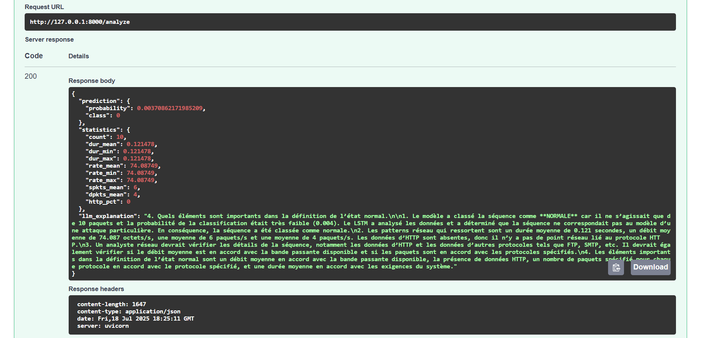

# Explainable network anomaly detection

**Détection d’anomalies réseau avec LSTM & explications LLM Mistral via FastAPI**

---

## Contexte et Objectif

Ce projet combine :
1. Un **modèle LSTM** entraîné sur le dataset **UNSW‑NB15** pour détecter les fenêtres de flux réseau anormales.
2. Un **LLM local** (Mistral‑7B‑instruct Q4_K_M) pour générer des explications techniques et actionnables.
3. Une **API FastAPI** exposant deux endpoints :
   - `/predict` : renvoie la probabilité et la classe (normal/anomalie).  
   - `/analyze` : retourne la prédiction + des statistiques agrégées + une explication détaillée du LLM.

---


## Installation

1. **Cloner** le dépôt  
   ```bash
   git clone https://github.com/xxUSERNAMExx/multi-agent-anomaly-detection.git
   cd multi-agent-anomaly-detection

2. Créer et activer un environnement Python
python -m venv venv
source venv/bin/activate   # macOS/Linux
venv\Scripts\activate      # Windows

3. Installer les dépendances
pip install fastapi uvicorn llama-cpp-python numpy pandas scikit-learn tensorflow

4. Placer le modèle Mistral .gguf dans models/, et copier :
- lstm_model.weights.h5
- scaler.pkl
- feature_info.json


---


## Lancement
uvicorn main:app --reload

→ L’API tourne sur http://127.0.0.1:8000

Docs interactives : http://127.0.0.1:8000/docs


---


## Usage
1) Prédiction brute (LSTM)
- POST /predict
   ```bash
   {
  "sequence": [ /* 10 objets flux réseau */ ]
   }
- Réponse
   ```bash
  { "probability": 0.0037, "class": 0 }

2) Analyse + explication LLM
- POST /analyze
   ```bash
   {
  "sequence": [ /* 10 objets flux réseau */ ]
   }
- Réponse
   ```bash
   {
  "prediction": { "probability":0.0037, "class":0 },
  "statistics": { "count":10, "dur_mean":… , … },
  "llm_explanation": "Analyse détaillée par Mistral…"
   }


---


## Détails techniques
- agent.py

   - Charge scaler.pkl, feature_info.json

   - Recrée l’architecture LSTM et charge lstm_model.weights.h5

   - preprocess_sequence() : encodage des colonnes catégorielles + scaling

   - predict() : probabilité + classe

- main.py

   - Import de l’agent et du LLM Mistral via llama_cpp.Llama

   - Endpoint /predict : retourne directement la sortie de agent.predict()

   - Endpoint /analyze :

      1. Appelle agent.predict()

      2. Calcule des statistiques globales (durée, débit, spkts, dpkts, % HTTP)

      3. Monte un prompt instructif pour Mistral

      4. Renvoie prédiction + stats + explication LLM

- Prompt engineering

Le prompt inclut les statistiques clés pour fournir un contexte synthétique, garantissant que Mistral analyse l’ensemble des 10 paquets.


---


## Résultats & Évaluation
- Dataset : UNSW‑NB15 (train + test en .parquet)

- Séquences : fenêtres glissantes de 10 paquets, étiquetées “anomalie” si au moins un paquet malicieux.

- Performance (test) :

   - Accuracy : 88 %

   - F1-score (Normal) : 0.82

   - F1-score (Attack) : 0.90

   - Macro F1 : 0.86


---


## Visualisations

<table>
  <tr>
    <td><strong>Interface utilisateur (FastAPI)</strong></td>
    <td><strong>Analyse du LLM (Mistral)</strong></td>
  </tr>
  <tr>
    <td>
      
    </td>
    <td>
      
    </td>
  </tr>
</table>

